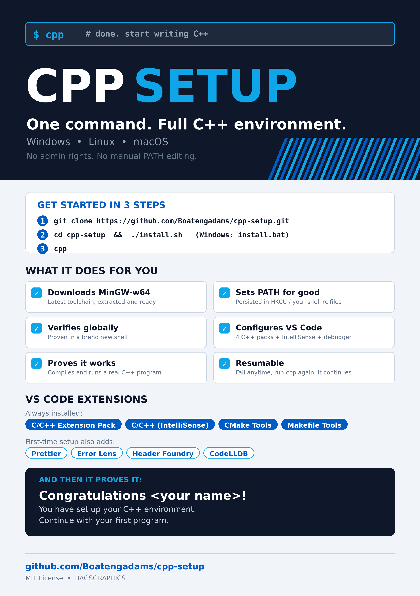

# cpp - one-command C++ environment setup

[](LICENSE)
[](https://www.python.org/)
[](#platform-notes)

Set up a **complete, working C++ environment on Windows, Linux and macOS** with a
single command. It downloads the latest MinGW-w64 toolchain, puts it on your
`PATH` for good, configures Visual Studio Code with the C++ extension packs, and
then proves everything works by building and running a real C++ program that asks
for your name.

**No prerequisites.** One script, one command, and you can start writing C++.

<p align="center">
  <a href="assets/cpp-setup-flyer.png">
    
  </a>
  <br>
  <sub><a href="assets/cpp-setup-flyer.png">open the flyer full size (A4, 300 DPI)</a> &middot; print-ready</sub>
</p>

---

## Quick start

```bash
git clone https://github.com/Boatengadams/cpp-setup.git
cd cpp-setup

# --- Linux, macOS, WSL, Git Bash, MSYS2 ---
./install.sh          # run once: puts `cpp` on your PATH

# --- Windows (Command Prompt or PowerShell) ---
install.bat           # run once: puts `cpp` on your PATH

# --- then, in a NEW terminal, on every platform ---
cpp
```

That is it. `cpp` installs everything and prints your personalised result:

```
============================================================
   Congratulations Ada!
   You have set up your C++ environment.
   You are done with your C++ setup - continue with your first program.
============================================================
```

> **It is resumable.** If any step fails - a dropped connection, a closed laptop,
> `Ctrl+C` - fix the problem, run `cpp` again, and it continues from the step that
> failed. Completed steps are never repeated, and a partial download is resumed
> rather than restarted.

> **New terminal required.** The toolchain is added to the *persistent* `PATH`,
> so open a new terminal window (or run `exec $SHELL`) before testing `g++`
> yourself. The setup itself already verifies the change in a brand new shell.

---

## Files in this repository

| File | Platform | Purpose |
|------|----------|---------|
| **`cpp.bat`** | **Windows** | **the Windows launcher you type as `cpp`** |
| **`cpp.sh`** | **Linux, macOS, WSL, Git Bash, MSYS2, Cygwin** | **the POSIX launcher you type as `cpp`** |
| `install.bat` | Windows | copies the launcher to `%LOCALAPPDATA%\cpp-setup\bin`, adds a `cpp.cmd` shim, updates your user `PATH` |
| `install.sh` | Linux, macOS | symlinks `cpp.sh` to `~/.local/bin/cpp` and adds that folder to your `PATH` |
| `cpp.py` | all | the shared Python entry point that both launchers call |
| `lib/` | all | the setup engine (Python 3, standard library only) |
| `tests/` | all | the unit test suite (no network required) |
| `assets/` | all | the print-ready flyer shown at the top of this page, plus the script that renders it |
| `.gitattributes` | all | keeps `.bat` files CRLF so `cmd.exe` parses them correctly |

**`cpp.bat` is the launcher for Windows and `cpp.sh` is the launcher for
everything else.** Both are thin wrappers with identical behaviour: they locate a
Python 3 interpreter (bootstrapping one on minimal systems), check that the
repository is intact, force UTF-8 output, and hand over to `cpp.py`. All the real
work lives in `lib/`, so the same engine is unit-testable on every platform and
the launchers stay small enough to read in one screen.

You can always run a launcher directly without installing:

```bat
cpp.bat --status          REM Windows
```
```bash
./cpp.sh --status         # Linux / macOS
```

---

## What `cpp` does

| # | Step | What happens |
|---|------|--------------|
| 1 | `preflight` | Checks the platform, creates `~/.cpp-setup/`, asks your name |
| 2 | `compiler_detect` | Looks for `g++` / `c++` / `clang++`; if none, suggests/installs one via your package manager |
| 3 | `compiler_mingw` | Downloads and unpacks the **latest MinGW-w64** toolchain (~80 MB, resumable download) |
| 4 | `compiler_path` | Adds the toolchain `bin/` to the **persistent** `PATH` (HKCU on Windows, shell rc files + `environment.d` on Linux/macOS) |
| 5 | `compiler_verify` | Starts a **brand new shell** and proves the compiler resolves globally |
| 6 | `vscode_detect` | Finds the `code` CLI |
| 7 | `vscode_install` | Installs VS Code if it is missing (per-user, no admin rights needed) |
| 8 | `vscode_extensions` | Installs the 4 C++ extension packs |
| 9 | `vscode_extras` | First-time setup also installs Prettier, Error Lens and the auto-complete helpers |
| 10 | `vscode_config` | Writes `.vscode/` config: IntelliSense, build tasks, debugger, recommended extensions |
| 11 | `test_project` | Creates and compiles `cpp_environment_check.cpp` |
| 12 | `test_run` | Runs it, feeds it your name, and **verifies the congratulation text** |
| 13 | `summary` | Prints the final report and the program output |

The four C++ extension packs installed in step 8:

1. **C/C++ Extension Pack** (`ms-vscode.cpptools-extension-pack`)
2. **C/C++** (`ms-vscode.cpptools`) - IntelliSense auto-complete + debugging
3. **CMake Tools** (`ms-vscode.cmake-tools`)
4. **Makefile Tools** (`ms-vscode.makefile-tools`)

First-time extras (step 9): **Prettier**, **Error Lens** (errors shown inline on
the line that causes them), **Header Foundry** and **CodeLLDB** for
auto-complete and header navigation.

---

## Requirements

- **Python 3.6+** and an internet connection. Nothing else - the tool is pure
  Python standard library, so there is no `pip install` step.
- If Python is missing, the launcher installs it for you with your system package
  manager (and tells you exactly what to do if it cannot).
- **No administrator rights are needed** on any platform. Everything is installed
  into your own user profile.

Both launchers force UTF-8 output so the banner, the status glyphs and your name
render correctly even in legacy Windows terminals (`cp437`/`cp1252`) and on
minimal Linux servers.

---

## Platform notes

**Windows** (`cpp.bat`) - installs a native WinLibs MinGW-w64 (UCRT, posix threads)
build and writes `PATH` to `HKCU\Environment`, so no administrator rights are
required. It broadcasts `WM_SETTINGCHANGE` so already-running programs pick the
change up. VS Code, when missing, is installed with Microsoft's per-user
installer, so you never see a UAC prompt.

**Linux** (`cpp.sh`) - installs llvm-mingw, which cross-compiles Windows binaries
from Linux, and writes a guarded block into `~/.zshenv`, `~/.zprofile`,
`~/.zshrc`, `~/.profile`, `~/.bash_profile` and `~/.bashrc` (plus a systemd
`environment.d` drop-in where applicable). Only the lines between the markers are
ever rewritten, and the block cannot duplicate an existing `PATH` entry.

**macOS** (`cpp.sh`) - installs llvm-mingw the same way, and downloads VS Code as
a `.dmg`, mounts it with `hdiutil` and copies the bundle to `/Applications`
(falling back to `~/Applications` when `/Applications` is not writable). The
system `AppleClang` is used for the native test program.

**WSL / Git Bash / MSYS2 / Cygwin** - `cpp.sh` works as-is and installs the
llvm-mingw toolchain inside the Linux environment. To cross-compile Windows
binaries, run the setup inside WSL and open the project in VS Code from Windows.

---

## The test program

Every run creates `~/.cpp-setup/workspace/cpp_environment_check.cpp`, compiles it
and runs it. It asks for your name and then prints:

```
============================================================
   Congratulations <your name>!
   You have set up your C++ environment.
   You are done with your C++ setup - continue with your first program.
============================================================
```

The tool checks the output really contains that text for the name you typed, so a
"success" is a real success, not just an exit code. On Linux and macOS it also
cross-compiles a Windows `.exe` with the MinGW toolchain to prove that side works
too.

---

## Commands

Every option works identically on all three platforms.

```bash
cpp                       # run (or resume) the whole setup
cpp --status              # show which steps are done, failed or pending
cpp --list-steps          # list the step ids
cpp --force <step> ...    # re-run specific steps even if they succeeded
cpp --only <step> ...     # run only those steps
cpp --run-test            # just rebuild and re-run the C++ test program
cpp --name "Ada"          # skip the name prompt (use in scripts / CI)
cpp --offline             # never download; use what is already installed
cpp --skip-vscode         # set up only the toolchain
cpp --workspace DIR       # put the project files somewhere else
cpp --uninstall           # undo the setup (see below)
cpp --reset               # forget all recorded state and start over
cpp -v                    # show the detail lines
cpp --no-color            # plain output (also honours the NO_COLOR env var)
cpp --version             # print the version
cpp --help                # full help
```

Useful step ids for `--force` / `--only`:

| Step id | What it does |
|---------|--------------|
| `preflight` | Preflight checks and workspace setup |
| `compiler_detect` | Detect an existing C++ compiler |
| `compiler_mingw` | Install the latest MinGW-w64 toolchain |
| `compiler_path` | Add the toolchain bin directories to PATH |
| `compiler_verify` | Verify the compiler works globally |
| `vscode_detect` | Detect Visual Studio Code |
| `vscode_install` | Install Visual Studio Code |
| `vscode_extensions` | Install the C++ extension packs |
| `vscode_extras` | Install the first-time extras (Prettier, Error Lens, ...) |
| `vscode_config` | Write the project `.vscode` configuration |
| `test_project` | Create and compile the C++ test program |
| `test_run` | Run the test program and check its output |
| `summary` | Print the final report |

```bash
cpp --force compiler_mingw    # get the newest MinGW build again
cpp --only test_run           # re-run just the C++ test
cpp --status                  # "is everything done?"
```

**Automating it** (CI, a fresh VM, a Docker image):

```bash
./install.sh && cpp --name "CI Runner" --yes --verbose
```

The `--yes` flag answers every question automatically.

---

## Where things go

| Path | Contents |
|------|----------|
| `~/.cpp-setup/toolchain/` | the installed MinGW-w64 toolchain |
| `~/.cpp-setup/cache/` | downloaded archives (reused, never re-downloaded) |
| `~/.cpp-setup/state.json` | which steps completed - this is what makes it resumable |
| `~/.cpp-setup/setup.log` | a full journal of every event |
| `~/.cpp-setup/workspace/` | the test program and the generated `.vscode/` config |
| `~/.local/bin/cpp` | the launcher created by `install.sh` (a symlink to `cpp.sh`) |

On Windows the launcher goes to `%LOCALAPPDATA%\cpp-setup\bin\cpp.cmd` and the
toolchain to `%USERPROFILE%\.cpp-setup\toolchain\`.

Your existing `.vscode/settings.json` is **merged**, never overwritten, and a
one-time `.cpp-setup.bak` copy of the original is kept.

---

## Working in VS Code afterwards

```bash
code ~/.cpp-setup/workspace
```

| Key | Action |
|-----|--------|
| `Ctrl+Shift+B` / `Cmd+Shift+B` | build and run the check program |
| `F5` | debug the check program |
| `Ctrl+Shift+P` -> `Tasks: Run Build Task` | pick `C++: build the current file` |

The generated `.vscode/` already has IntelliSense pointed at your compiler, a
`-Wall -Wextra` build task with the `$gcc` problem matcher (so squiggles and the
Problems panel are correct), a `cppdbg` launch config, and an
`extensions.json` recommending the same extensions. Open any folder and start
writing C++.

---

## Running the tests

```bash
python3 tests/test_units.py     # 66 unit tests, no network needed
```

They cover the state machine and resume logic, the PATH block writer (including
idempotency and removal), the JSONC merge used for `.vscode` files, the asset
selector, the download resume, the archive extraction, the generated C++ program
and the launcher scripts.

---

## About the flyer

`assets/cpp-setup-flyer.png` is the print-ready version of the image at the top of
this page - A4 portrait at 300 DPI. It is generated by
[`assets/make_flyer.py`](assets/make_flyer.py), so the copy can be updated
without any external design tool:

```bash
pip install pillow
python3 assets/make_flyer.py     # rewrites assets/cpp-setup-flyer.png
```

The script lays the page out top-down with an explicit cursor and a `need()`
guard that **aborts the build** if a section would run past the footer, instead
of silently clipping the content. If you add a feature, add a line to `features`
and the guard will tell you if the page no longer fits.

---

## Troubleshooting

| Symptom | What to do |
|---------|------------|
| `cpp: command not found` | the installer did not add the folder to your `PATH`; open a new terminal, or run `cpp.sh` / `cpp.bat` directly |
| `python3 is required but was not found` | install Python 3.6 or newer; the printed message has the exact command |
| "Could not download ..." | re-run `cpp` - the partial download resumes where it stopped |
| `g++` not visible in a new terminal | open a genuinely new terminal window (`exec $SHELL` also works), then `cpp` |
| An extension failed to install | the setup still finishes; install it later from the Extensions view, or `cpp --only vscode_extensions` |
| `clang++`/`g++` reports a missing DLL or library | delete `~/.cpp-setup/toolchain` and run `cpp --force compiler_mingw` |
| Want to start over completely | `cpp --reset` |

---

## Removing the setup

```bash
cpp --uninstall
```

This removes the `PATH` entries this tool added (only the ones inside its own
markers) and deletes `~/.cpp-setup/`. The toolchain and VS Code themselves are
left alone, since other software may rely on them. On Windows it also removes
the `%LOCALAPPDATA%\cpp-setup\bin` entry from your user `PATH`.

To remove the launchers too, delete `~/.local/bin/cpp` (Linux/macOS) or
`%LOCALAPPDATA%\cpp-setup\bin` (Windows).

---

## Contributing

This project is maintained by a single contributor.

| | |
|---|---|
| **Author and maintainer** | **BAGSGRAPHICS** (`boatengadams4g@gmail.com`) |
| Repository | `https://github.com/Boatengadams/cpp-setup` |

Issues and pull requests are welcome. Before opening a pull request, please run
the test suite:

```bash
python3 tests/test_units.py
```

Guidelines:

- Keep the launchers (`cpp.bat`, `cpp.sh`) small - they only bootstrap and hand
  over. Real logic belongs in `lib/`.
- **Standard library only.** No `pip install`, no third-party packages, so the
  tool works on a bare machine.
- Anything that touches a user's system must be reversible, must be guarded by
  markers, and must never require administrator rights.
- New work should be a step in the state machine so that it stays resumable, and
  should come with a unit test.

---

## License

MIT - see [LICENSE](LICENSE). Third-party components downloaded by the tool
(MinGW-w64 / llvm-mingw, Visual Studio Code and its extensions) keep their own
licenses.

